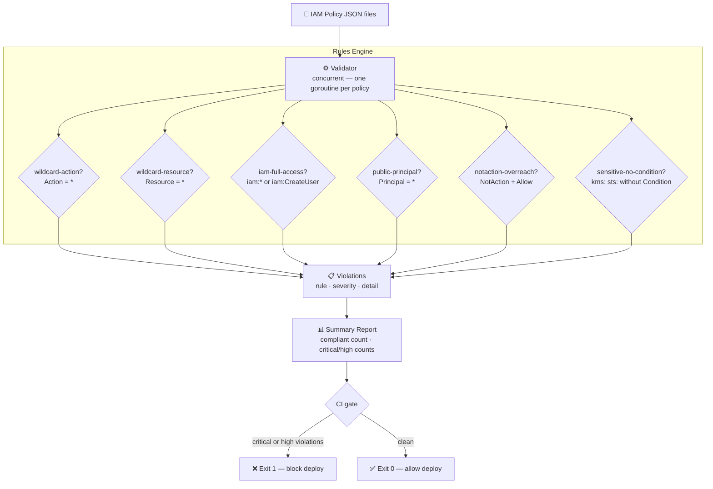

# iam-policy-scanner


A fast, concurrent IAM policy scanner that detects overly permissive rules before they reach production — written in Go.

Built to validate the principle that **access control problems are cheaper to catch at policy-definition time than at incident-response time.**

---

## The Problem → Solution → Impact

| | |
|---|---|
| **Problem** | IAM policies accumulate over time across thousands of systems. Wildcards get added under deadline pressure, `iam:*` permissions creep in, and public principals go unnoticed. Manual review at that scale is impossible — misconfigurations slip through and become exploitable in production. |
| **Solution** | A fast, concurrent scanner — one goroutine per policy — that validates every permission assignment and blocks deployments on violations. Runs in CI/CD on every policy commit. |
| **Impact** | Turns manual, error-prone policy review into an automated check that runs on every commit — catching wildcard actions, public principals, and unscoped resources before they reach production. |

---

## System Design



---

## Compliance Rules

| Rule | Severity | What It Detects |
|------|----------|----------------|
| `wildcard-action` | 🔴 CRITICAL | `Action: "*"` — unrestricted access to all AWS services |
| `iam-full-access` | 🔴 CRITICAL | `iam:*`, `iam:CreateUser`, `iam:AttachRolePolicy`, `iam:CreateAccessKey` — privilege escalation vectors |
| `public-principal` | 🔴 CRITICAL | `Principal: "*"` — allows unauthenticated or cross-account access |
| `wildcard-resource` | 🟠 HIGH | `Resource: "*"` — permissions apply to all resources, not scoped ARNs |
| `notaction-overreach` | 🟠 HIGH | `NotAction` + `Allow` — grants all actions except a small exclusion list |
| `sensitive-service-no-condition` | 🟡 MEDIUM | `kms:`, `secretsmanager:`, `sts:AssumeRole`, `lambda:InvokeFunction` with no `Condition` block |

---

## Usage

```bash
iam-policy-scanner policy.json               # human-readable summary
iam-policy-scanner --json policies/*.json    # JSON output
iam-policy-scanner --sarif policies/*.json   # SARIF 2.1.0, for GitHub code scanning
```

```bash
# Build
go build -o iam-policy-scanner ./cmd/scanner/

# Scan a single policy
./iam-policy-scanner testdata/overpermissive.json

# Scan multiple policies concurrently
./iam-policy-scanner policies/*.json

# JSON output for integration with other tools
./iam-policy-scanner --json policies/*.json | jq '.critical_count'
```

### Example Output

```
━━━━━━━━━━━━━━━━━━━━━━━━━━━━━━━━━━━━
  IAM Policy Scan Results
━━━━━━━━━━━━━━━━━━━━━━━━━━━━━━━━━━━━

  Policies scanned:  2
  Compliant:         1
  Violations found:  2
  ⛔ CRITICAL:        1
  ⚠️  HIGH:           1

  ✅ compliant-example — no violations

  ❌ overpermissive-example
     [CRITICAL] [AdminAccess] wildcard-action
       Action "*" grants unrestricted access to all AWS services
     [HIGH] [AdminAccess] wildcard-resource
       Resource "*" applies permissions to all resources — scope to specific ARNs

━━━━━━━━━━━━━━━━━━━━━━━━━━━━━━━━━━━━
```

Exit code 1 when CRITICAL or HIGH violations found — integrates directly with CI/CD gates.

---

## CI/CD Integration

Add a policy scan step before any IAM deployment:

```yaml
# .github/workflows/deploy.yml
- name: Scan IAM policies
  run: |
    go build -o iam-policy-scanner ./cmd/scanner/
    ./iam-policy-scanner policies/*.json
  # Non-zero exit blocks the workflow automatically
```

Or with pre-commit hooks:

```bash
# .pre-commit-config.yaml
- repo: local
  hooks:
    - id: iam-policy-scan
      name: IAM Policy Scan
      entry: ./iam-policy-scanner
      files: '\.json$'
```

---

## Project Structure

```
iam-policy-scanner/
├── cmd/scanner/
│   └── main.go              # CLI entry point — flags, file loading, exit codes
├── internal/
│   ├── policy/
│   │   ├── rules.go         # Compliance rules — each rule is a pure function
│   │   ├── validator.go     # Concurrent scanner — goroutine per policy
│   │   ├── validator_test.go # Table-driven tests — 8 test cases
│   │   ├── cache.go         # Scan result cache, keyed by file hash (not yet wired into the CLI)
│   │   └── cache_test.go    # 5 tests
│   └── report/
│       ├── reporter.go      # Human-readable and JSON output formatters
│       ├── sarif.go         # SARIF 2.1.0 output for GitHub code scanning
│       └── sarif_test.go    # 5 tests
├── pkg/types/
│   └── policy.go            # Shared types: Policy, Statement, Violation, SummaryReport
├── testdata/
│   ├── overpermissive.json  # Example: wildcard action + resource
│   └── compliant.json       # Example: scoped S3 read permissions
└── go.mod
```

---

## Design Decisions

**Why Go:**
IAM scanning runs on every policy commit in CI. Go's goroutine-per-policy model and fast startup time make it a good fit for that: no interpreter warm-up cost, and each policy file scans concurrently rather than one at a time.

**Why rule functions, not regex:**
Each rule is a pure function `(Statement) → (bool, string)`. Rules are composable, independently testable, and easy to extend without modifying the scanner core.

**Why exit code 1 for HIGH+CRITICAL:**
CI/CD pipelines read exit codes. A scanner that only prints warnings gets ignored. Hard blocking on severity ≥ HIGH forces remediation before merge.

**Concurrency model:**
One goroutine per policy, results written to a pre-allocated slice by index — no mutex needed. The `sync.WaitGroup` coordinates completion.

---

## Extending with Custom Rules

```go
customRule := policy.Rule{
    Name:     "no-s3-delete",
    Severity: types.High,
    Check: func(s types.Statement) (bool, string) {
        for _, action := range s.Action {
            if action == "s3:DeleteObject" || action == "s3:DeleteBucket" {
                return true, "S3 delete operations require explicit approval"
            }
        }
        return false, ""
    },
}

v := policy.NewWithRules(append(policy.DefaultRules(), customRule))
```

---

## Running Tests

```bash
go test ./... -v -race
```

The `-race` flag enables Go's built-in data race detector — validates that concurrent scanning is safe.

---

## Part of the Agentic Infrastructure Stack

| Repo | What It Is |
|------|-----------|
| **[agentic-ops](https://github.com/TushGoel/agentic-ops)** | Full system design: how IAM validation fits into a production AI agent platform |
| **[production-mcp-server](https://github.com/TushGoel/production-mcp-server)** | The MCP governance layer (Python) — permission enforcement for AI agents |
| **[agent-eval-framework](https://github.com/TushGoel/agent-eval-framework)** | Agent quality measurement and regression detection (Python) |
| **[iam-policy-scanner](https://github.com/TushGoel/iam-policy-scanner)** | ← You are here: IAM compliance scanning (Go) |

---

## License

MIT
